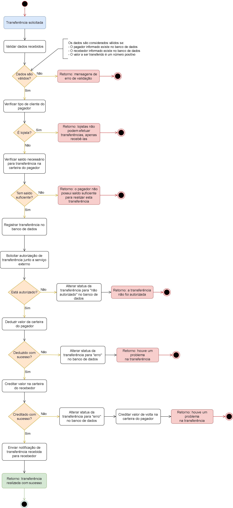

# Resolvendo o desafio

### Banco de dados e arquitetura

No quesito banco de dados foi escolhido para a persistência dos dados requeridos pela aplicação o uso do **MySQL**, que é um banco de dados relacional com o qual já tenho familiaridade.

Para a construção da API foi utilizado o **Laravel**, um framework *open source* de **PHP** cujo objetivo é permitir que o desenvolvedor trabalhe de forma mais rápida e eficaz, com um foco maior no desenvolvimento das regras de negócio e menor em questões de arquitetura e configurações. Dentre as *features* do framework utilizadas podemos citar as *classes requests*, que realizam validação de dados recebidos, e os models construídos com *Eloquent*, um poderoso ORM (Object Relational Mapper) que já vêm embutido no Laravel por padrão.

Com relação a arquitetura foi decidido efetuar uma distribuição do código em diferentes pastas de domínio, uma ideia inspirada em conceitos do DDD (Domain Driven Design). Desta maneira foram gerados pastas de domínio para "transfer", "common" e "user", por exemplo, e a lógica do negócio foi dividida entre elas objetivando uma melhor organização. 

Além disso também foram adotados os padrões de projeto **service pattern** e **repository pattern** com o intuito de ter uma divisão entre as camadas de regra de negócio, de manipulação de dados e de apresentação de dados, permitindo uma maior separação de responsabilidades e facilitando a reutilização de trechos de códigos, respeitando, desta forma, a abordagem do DRY (Don’t Repeat Yourself).

### Diagrama de fluxo

Foi desenhado um diagrama de fluxo para a aplicação usando a ferramenta [Draw.io](https://app.diagrams.net/).

<a href="./diagrams/pagamento_simplificado.drawio.png" target="_blank">
    
</a>

### Ambiente

Visando evitar problemas de divergência de ambientes em diferentes máquinas, todo o código da aplicação foi incluído em containers criados com a ferramenta **Docker**.

### Explicação da API

#### Sobre os usuários

Um dos pontos de atenção levantados na descrição do desafio é a necessidade de se validar os dados necessários para criação de usuários. São requeridos os campos `Nome Completo`, `Número do Documento (CPF/CNPJ)`, `E-mail` e `Senha`, sendo que `Número do Documento (CPF/CNPJ)` e `E-mail` devem ser únicos. Apesar de não ser obrigatório, foi decidido criar uma estrutura para gerenciamento de usuários, permitindo ações de criação, atualização, remoção, visualização e listagem. A ação de remoção usa a abordagem do *soft delete*, ou seja, os usuários não são removidos de verdade do banco de dados, apenas sinalizados como removidos, o que ajuda a manter a consistência das informações de transferências (transferências não vão estar vinculadas a usuários que não existem no banco de dados).

Outro ponto com relação aos usuários foi a implementação das entidades `user_types` e `document_types`. O objetivo destas entidades é organizar informações de tipos e permitir que mais itens sejam adicionados futuramente. Por padrão a aplicação conta com os tipos de usuário `comum` e `lojista` e com os tipos de documento `cnpj` e `cpf`, sendo estes dados obtidos da descrição do desafio. Para facilitar a identificação dos tipos internamente no código, também foram incluídas classes enum (*DocumentTypeEnum* e *UserTypeEnum*).

Após a ação de criação de usuário, a aplicação coloca notificações com uma mensagem de boas-vindas em filas de execução (*queues*). As notificações são disparadas por dois canais diferentes (`email` e `sms`), mas seu comportamento é modificado para apenas simular os envios visto que não estamos em ambiente de produção. Os envios simulados registram informações em logs e também na entidade `notifications` do banco de dados. Para que as notificações sejam disparadas é necessário rodar os seguintes comandos no terminal:

```
// Para entrar no container
docker-compose exec -it main bash

// Para processar itens que estão na fila
php artisan queue:work --queue=notifications
```

Caso queira saber mais detalhes sobre filas de execução (*queues*), você deve se referir ao tópico **Filas / Queues** na seguinte [página](using_api.md).

Caso não deseje lidar com a criação de usuários, a aplicação fornece alguns usuários padrão para sua conveniência. São fornecidos 2 usuários do tipo **comum** (John Doe e Jane Doe) e 2 usuários do tipo **lojista** (Pokemon Company e Stark Industries), sendo as informações destes obtidas pelo endpoint de listagem de usuários.

```json
GET {{baseUrl}}/users
Accept: {{accept}}
Content-Type: {{contentType}}
Authorization: Bearer {{accessToken}}
```

#### Sobre as carteiras de usuários

Atrelado a entidade `users` nós temos a entidade `wallets`, que são as carteiras que armazenam os valores monetários disponíveis para cada usuário. São estes valores que são utilizados nas transferências. Nesta aplicação um usuário pode possuir apenas uma carteira.

#### Sobre o serviço de autorização externo

Antes de concretizar uma transferência se faz necessário efetuar uma `autorização` da mesma utilizando um **serviço de autorização externo**, ou seja, um serviço de terceiros. Para o caso deste desafio foi dado o nome fictício de **ExtAutho** para o serviço de autorização externo e a aplicação conta com classes de integração para o correto consumo/utilização do mesmo. O desafio fornece uma url para o autorizador externo, sendo que esta retorna aleatoriamente uma resposta positiva ou negativa para a autorização. Nenhum parâmetro para ser enviado na requisição foi especificado, então foram utilizadas algumas informações da transferência. 

Em alguns momentos durante o desenvolvimento desta aplicação, a url fornecida apresentou instabilidade, então foi decidido criar uma rota interna da aplicação para simular o mesmo comportamento do serviço externo (ou seja, um *mock* do serviço externo). Desta forma podemos alternar entre as duas urls conforme necessário, sem deixar que a aplicação fique desprovida de um autorizador de transferências. A url do serviço de autorização de transferências fica disponível na variável de ambiente `EXTERNAL_AUTHORIZATION_SERVICE_URL` presente no arquivo `.env`, conforme exemplificado a seguir.

```
EXTERNAL_AUTHORIZATION_SERVICE_URL=http://nginx:80/api/mocks/external-authorization/authorize # Esta é a versão "mockada"
#EXTERNAL_AUTHORIZATION_SERVICE_URL=https://util.devi.tools/api/v2/authorize # Esta é a url providenciada pelo desafio
```

Lembre-se de deixar apenas uma versão da variável *EXTERNAL_AUTHORIZATION_SERVICE_URL* ativa, mantendo a outra comentada com o símbolo `#` em precedência.

As respostas de solicitação de autorização (seja usando a url fornecida pelo desafio ou usando mock do serviço externo) são persistidas na entidade `transfer_authorization_responses`. Num cenário real, armazenar estas informações fornece material para solicitar suporte junto ao serviço externo em casos de erros inesperados.

#### Sobre o serviço de notificação externo

Breve.

#### Sobre a criação de uma transferência

Com os usuários a serem envolvidos definidos e as variaveis de ambiente relacionadas a serviços externos devidamente configuradas, é o momento de executar transferências. Para isso você deverá utilizar o seguinte endpoint.

```json
POST {{baseUrl}}/transfers
Accept: {{accept}}
Content-Type: {{contentType}}
Authorization: Bearer {{accessToken}}

{
  "value": 10.50,
  "payer": 1,
  "payee": 2
}
```

Com relação ao corpo da requisição temos as seguintes informações.

- "value": a quantia a ser transferida. Espera-se um valor numérico.
- "payer": ou "pagador", a pessoa que vai **enviar** uma quantia em dinheiro para um outro usuário. Aqui precisamos do ID de usuário desta pessoa.
- "payee": ou "recebedor", a pessoa que vai **receber** uma quantia em dinheiro de outro usuário. Aqui precisamos do ID de usuário desta pessoa.

As regras de negócio informadas na descrição do desafio foram implantadas na forma de validação dos dados recebidos. Requisições barradas por validação não geram persistência de informações na entidade `transfers`.

Se a transferência falhar você poderá consultar o arquivo de log do dia atual para obter mais informações. Mensagens de logs para erros foram incluídas nas etapas do fluxo de transferência para fornecer observabilidade sobre possíveis problemas. Mesmo com a falha, ainda serão persistadas informações sobre a tentativa de transferência na entidade `transfers`.

Se a transferência for um sucesso serão retornadas informações da mesma obtidas do banco de dados, como detalhes básicos do pagador e do recebedor (incluindo o saldo atual de sua carteira), montante envolvido, data de autorização e status da transferência. Você poderá, caso ache necessário, consultar estas informações diretamente no banco de dados se referindo as tabelas `users`, `wallets`, `transfer_auhtorization_responses` e `transfers`.

### Segurança

Com relação a segurança da API, foi utilizada uma proteção das rotas com a exigência de envio de um token de acesso no cabeçalho das requisições. A aplicação fornece um usuário padrão para uso e uma rota para geração de tokens. Detalhes sobre esta rota podem ser obtidos na *documentação da API*.

Embora não tenha sido solicitado nada nesse sentido na descrição do desafio, foi considerado válido incluir algum tipo de proteção para a API.

### Stubs customizados

Como um extra do projeto foram implementados arquivos *stubs* para criar classes do tipo *service*, *repository* e *DTO*. Você pode utilizá-los durante desenvolvimento a partir de comandos no *artisan*, conforme exemplos a seguir:

Criando classe service:

```
php artisan make:service UserService
ou
php artisan make:service Domain/User/Services/UserService
```

Criando classe repository:

```
php artisan make:repository UserRepository
ou
php artisan make:repository Domain/User/Repositories/UserRepository
```

Criando classe DTO (Data Transfer Object):

```
php artisan make:dto CreateUserDto
ou
php artisan make:dto Domain/User/DataTransferObjects/CreateUserDto
```

As classes DTO fazem uso do package **laravel-data**.

### Testes

Os testes da aplicação, importantes para controle de comportamentos esperados e detecção de falhas de fluxo, foram construídos usando o *PHPUnit*. Caso queira saber mais detalhes sobre como executá-los, você pode se referir ao tópico **Rodando Testes** na seguinte [página](using_api.md).

### Documentação da API

Para a criação da documentação da API foi utilizado o [Scribe](https://scribe.knuckles.wtf/laravel/), um package especializado em gerar documentações com uma linguagem mais humanizada a partir do código-fonte de aplicações *Laravel* ou *Lumen*.

Você pode acessar a documentação da API através da seguinte URL:

```
http://localhost:9999/api-docs
```

Lembre-se de iniciar a aplicação antes de tentar acessar a página da documentação da API.